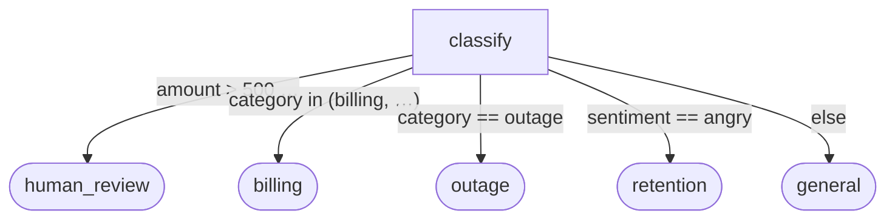

# PrismPath — agent workflows as data

[](https://github.com/OWNER/PrismPath/actions/workflows/ci.yml)
&nbsp;[](LICENSE)

<!-- Replace OWNER with the GitHub org/user once the remote is set; the badge resolves after the first push. -->

**The document your team reads is the graph the engine runs.**
Read it. Diff it. Lint it. Test it. Lock it. Prove it. — six verbs, each backed by a shipped
tool, none available to a routing callback.

Every operational domain eventually makes this move: infrastructure went from shell scripts to
Terraform, CI from Jenkins jobs to YAML in the repo, deployment from runbooks to manifests —
imperative code owned by engineers becomes **declarative data owned by the people who own the
process**. Agent orchestration is still in its shell-script era, smeared across Python
callbacks. PrismPath is that transition.

## The whole idea in one file

```markdown
---
name: support_triage
start: classify
---

## classify
Read the incoming support ticket. Emit `category`, `amount`, and `sentiment`.
-> human_review: when category == "billing_dispute" and amount > 500
-> billing: when category in ("billing", "billing_dispute")
-> outage: when category == "outage"
-> retention: when sentiment == "angry"
-> general: else

## human_review
A person decides. High-value billing disputes are never auto-routed.

## outage
Page the on-call engineer.
```

That file **is** the program. The same document, as the engine sees it (`prismpath graph`):



And because the flow is data, **a pull request is a process change**: the `human_review` rule
above lands as a three-line prose diff, a fixture row asserts it in CI (milliseconds, no
model), and merging it changes production routing — no deploy, no engineer. **See it run:**
[`examples/pr_demo/`](prismpath/examples/pr_demo/README.md).

## Measured, not asserted

N=301 labeled routing decisions, 8 flows, same local model for every arm
([benchmark/](prismpath/benchmark/), reproducible):

| arm | accuracy | LLM calls / 1k decisions | median latency | p95 |
|---|---|---|---|---|
| **PrismPath** (hybrid over learned centroids, δ=0.03) | **95.3%** | **360** | **205 ms** | 655 ms |
| **PrismPath** (economy point, δ=0.01) | 90.0% | **160** | ~205 ms | — |
| PrismPath (zero-shot hybrid, δ=0.05) | 83.7% | 383 | 205 ms | 655 ms |
| LangGraph | 99.0% | 1000 | ~435 ms | ~460 ms |
| CrewAI | 99.0% | 1000 | ~435 ms | ~460 ms |
| LLM-router | 99.0% | 1000 | ~435 ms | ~460 ms |

```bash
python -m prismpath.comparisons.run_comparison   # reproduce the table against your own endpoint
```

The trade is explicit and **tunable**: the recommended configuration (LLM-on-doubt over
**learned per-condition centroids**, 5-fold cross-validated, `benchmark/hybrid_sweep.py`) reaches
95.3% at 2.8× fewer LLM calls and ~2× lower median latency; δ — or a risk-calibrated τ with a
finite-sample guarantee — slides the same frontier from 90% @ 160 calls/1k to ~99.7% at
always-call. The honest costs: a bimodal p95 on escalated hops, and centroids need labeled
history (zero-shot is the cold-start row). The external arms are more accurate out of the box
because they pay the model for *every* transition; if that's the right trade for you, see the
box below.

## Quickstart

```bash
git clone <this-repo> && cd prismpath
pip install -e .                              # numpy only; embedder is an optional extra
prismpath validate prismpath/examples/pr_demo/triage.md   # "your flow compiles"
prismpath test prismpath/examples/pr_demo/triage.md       # fixture-asserted routing, no model
```

Or skip the terminal: the **[playground](prismpath/portable/playground.html)** runs the portable
kernel in your browser — paste a flow, watch it route ([serve it](prismpath/portable/README.md)).
The full walk from "what's this?" to a real agent driving your own flow is
**[GETTING_STARTED.md](GETTING_STARTED.md)** — every step executed before it was written,
honestly counted (spoiler: eight).

## When PrismPath is the wrong tool

- **A linear pipeline with no branching** — you don't need routing; a script is fine.
- **Maximum accuracy at any cost** — an LLM-on-every-transition router hits 99% on our own
  benchmark. PrismPath's point is spending the model only where it's needed; if call volume is
  irrelevant to you, that advantage is too.
- **You want a hosted platform and a connector catalog** — PrismPath is a format + kernel + control
  plane, deliberately not a SaaS or an integration ecosystem.
- **Sub-millisecond routing over *semantic* conditions everywhere** — the semantic tier costs an
  embedding; only the deterministic tier is free (though for fields-only flows, that tier
  [runs anywhere](prismpath/portable/README.md), browser to edge).
- **Run state grows unless you bound it** — `@state_bound(transcript=N)` sliding-windows the
  transcript and re-seeded history (deterministic drop accounting; routing counters never
  windowed) so long-lived runs keep a flat checkpoint; it is opt-in per flow.

Onboarding a team? **[LEARNING_PLAN.md](LEARNING_PLAN.md)** walks an analyst, a developer, and an
engineer to fluency on parallel tracks — same artifacts, one shared vocabulary.

## Five doors

- **Coming from LangGraph?** `prismpath import your_graph.py` renders your `StateGraph` as a
  skeleton flow — see what your control flow looks like as prose in fifteen minutes.
- **Platform / SRE:** [the lockfile](prismpath/AUTHORING.md) (bit-reproducible routing),
  ["your flow compiles"](#your-flow-compiles--static-analysis), OTel decision spans into the
  Grafana/Jaeger/Datadog you already run — decision-level semantics (margin, escalated-or-not) as
  span attributes, not a new pane of glass to adopt.
- **Security / compliance:** the [SOC triage case](prismpath/PRISMPATH_USECASE_blue_team_soc_triage.md)
  — prefilter reuse measured live, human-gated containment, ledger proofs, air-gap-friendly
  [portable subset](prismpath/portable/README.md).
- **Process owner / PM:** the [playground](prismpath/portable/playground.html) and the
  [persona examples](prismpath/examples/README.md) — no terminal required. Contribute your own workflow (no code) to the [gallery](prismpath/gallery/README.md).
- **Researcher:** the [benchmark](prismpath/benchmark/), the [papers](prismpath/docs/papers/), and the
  [format spec](SPEC.md) with its machine-checkable conformance vectors.

> **Commercial support & custom flows** — PrismPath is developed by Crystal Warden Labs; we build
> and operate gated agent workflows (SOC triage, OT/edge policy enforcement) for clients.

---

## The reference deployment — what we run in production on top

Everything above is the **format play**: the spec, the kernel, the toolchain. Everything below is
the **reference deployment** — the control plane Crystal Warden Labs runs to build real software
with a local agent swarm. It is credibility proof, not part of the format: a conforming runtime
needs none of it, and its examples (browser gates, Roblox plugins, sprint councils) speak the
dialect of *our* production, not yours.

## The two layers

PrismPath turns a **human's intent into a supervised, gated build run by a local-LLM agent swarm**.
It has two layers:

- **The flow kernel** — *one markdown file is the workflow.* Each `## heading` is a node (its prose
  is the instruction handed to an agent); `-> target: condition` lines are the edges. No `StateGraph`,
  no routing functions in code — a PM, analyst, or domain expert can author and read a flow.
- **The control plane on top** — a spec-driven **sprint** loop that drives the swarm: a council picks
  the next unit of work, an executor edits the real tree, and **deterministic gates decide when it's
  done**. Progress is observable live through Mission Control. Build targets (e.g. browser apps, or
  Roblox/Luau via a plugin) are pluggable; the engine itself stays game- and platform-agnostic.

> The thesis: **a human holds the vision; the swarm builds; gates — not prose — define done.**
> See [FRAMEWORK.md](prismpath/FRAMEWORK.md) for the operating methodology and hard-won lessons.

---

## A worked example: one line in, a checked app out

Before the abstractions, here's the whole thing on a real task. You want a tip calculator. You hand the
control plane that one line of intent:

```bash
SPRINT_PROJ=/tmp/tip SPRINT_GATE=browser SPRINT_NUDGE="a tip calculator" python -u prismpath/run_sprint.py
```

From there the loop runs on its own:

1. **Build.** The swarm turns the intent into a small file layout (`index.html` + a little JS) and the
   coder writes the first version into `/tmp/tip`.
2. **Gate — the definition of done, machine-enforced.** The browser gate checks the result the way a
   reviewer would, not "does it look finished": every JS file parses (`node --check`); every `import`
   resolves to a symbol that's really exported; every `getElementById('total')` the JS references
   actually exists in the HTML; and then the real test — a **headless Chromium loads the page, fills the
   bill input, clicks the button, and asserts the DOM actually changed**.
3. **Red → fix, and loop.** If clicking does nothing, the gate says exactly that — *"the primary control
   produced no visible change… its handler is likely not wired"* — and that message becomes the coder's
   next task. Build → gate → fix repeats; if the same error recurs 3×, it escalates (to agy, then you).
4. **Green → done.** The build is "done" only when every check passes. You open `/tmp/tip/index.html`
   and it works — because a machine already confirmed the button *does* something, not just that code
   exists to handle it.

That's the **control plane** with the built-in **browser gate**. Swap `SPRINT_GATE` for a plugin (e.g.
Roblox/Luau) and the identical loop targets a different world — same discipline, different gate. The
rest of this README is the two layers underneath that run.

---

## The flow kernel

Routing is a **spectrum chosen by the engine, not the author**:

| edge kind | syntax | how it routes | cost |
|---|---|---|---|
| **deterministic** | `-> t: when <expr>` (also `always`/`else`/`false`) | a safe predicate over the agent's structured outcome (+ a `visits` counter) | free, exact |
| **semantic** | `-> t: <natural language>` | embed the outcome vs the condition; escalate to a 1-shot LLM only on low confidence | ~free + rare LLM |

> *Logic where logic exists, intent where it doesn't.* Negation, counts, and thresholds are written
> as `when ...` predicates (free, never misroute); genuine judgment is left to the hybrid router. At a
> node, **deterministic edges are evaluated first, in document order — first true wins**; only if none
> match do the semantic edges go to the router.

### A minimal flow

```markdown
---
name: coding
start: write_code
---

## write_code
Write or revise the function so it passes the tests.
-> run_tests: when always

## run_tests
Run the hidden test suite.
-> done: when tests_pass
-> give_up: when visits > 3
-> debug: when not tests_pass

## debug
Judge whether the fix is clear or the task is unsolvable.
-> write_code: the fix is clear, edit the code and try again
-> give_up: the problem is unsolvable

## done
All tests pass.

## give_up
Too many attempts.
```

### The agent contract

The engine is agent-agnostic. You pass `run(graph, agent, router=...)` where:

```python
agent(node_name: str, instruction: str, state: dict) -> str | dict
```

- Return a **string** → it becomes the text used for semantic routing.
- Return a **dict** `{"text": ..., <field>: <value>, ...}` → `text` feeds semantic routing and the
  other fields are the variables the deterministic `when` predicates see (e.g. a `run_tests` node
  returns `{"tests_pass": True, "text": "all tests passed"}` so `-> done: when tests_pass` fires
  deterministically).

`state` is a dict shared across the whole run; the engine seeds `state["transcript"]` and
`state["visits"]` (per-node entry counts). `run(...)` returns `RunResult(path, steps, stopped, state)`.

### Routers

```python
from prismpath.engine import run
from prismpath.router import HybridRouter, LLMRouter
from prismpath import llm_local

router = HybridRouter(LLMRouter(llm_local.generate), margin=0.05)  # recommended
run(graph, agent, router=router)
```

- `EmbeddingRouter()` — cosine only (cheap, ~0.82 on the routing bench).
- `LLMRouter(generate_fn)` — a 1-shot LLM picks the edge (accurate, costs a call).
- `HybridRouter(LLMRouter(...), margin=0.05)` — embed first; escalate to the LLM only when the
  top-1↔top-2 margin < `margin`. The frontier is smooth (re-derived at N=300:
  `benchmark/hybrid_sweep.py`); stack it over `CentroidRouter` for the measured best
  accuracy-per-call, and derive the margin with `prismpath calibrate` rather than hand-picking.

### The prefilter cache — skip the expensive node entirely (opt-in)

Routing is cheap; in *triage-shaped* flows the cost concentrates in one **adjudication node**
(an LLM classification) whose inputs recur near-identically. `PrefilterCache` memoizes its
verdicts: look the incoming document up before the call — a near-identical prior (cosine ≥ 0.97)
whose verdict carried confidence ≥ 0.8 is reused and the call is **skipped**; a miss
adjudicates, then `learn()`s the fresh verdict so the cache compounds.

```python
from prismpath.prefilter import PrefilterCache

cache = PrefilterCache("corpus/")            # lazy; pluggable embed_fn
res = cache.lookup(document)
if res.hit:
    act_on(res.record["action"])             # LLM call skipped, reuse logged + auditable
else:
    verdict = expensive_adjudication(document)
    cache.learn(res.vector, verdict.action, verdict.confidence)
```

In a flow it's just a node with deterministic edges on the cached action — see
[`flows/wazuh_triage.md`](prismpath/flows/wazuh_triage.md) (`vector_prefilter`). **Measured live on SOC
alert triage: ~59% of alerts auto-resolve at threshold 0.97 → ~2.4× capacity** before the LLM
tier is touched ([use case](prismpath/PRISMPATH_USECASE_blue_team_soc_triage.md)).

This is **use-as-needed, not an engine default** — nothing invokes it implicitly. It pays off
only when one node dominates cost, inputs genuinely recur, and a prior verdict is still valid
when the same input recurs; it is wrong for generative, novelty-heavy, or context-dependent
nodes. See [AUTHORING.md](prismpath/AUTHORING.md) for the applicability test.

### Your flow compiles — static analysis

Because the flow *is* the graph (a Markdown file, not code smeared across Python), the whole
control structure is checkable **before you run anything** — a guarantee a code-first framework
structurally can't give. `prismpath validate` runs a set of *decidable* checks (no model, no
embeddings) and exits non-zero on any error:

| check | severity | what it catches |
|---|---|---|
| undefined start / edge target | error | an edge points at a node that isn't defined |
| unsafe / unparseable predicate | error | a `when` that isn't safe & well-formed (see the sandbox) |
| no reachable terminal | error | the flow can only ever end at `max_steps` |
| unreachable node | warning | a node nothing routes to |
| possible stuck | warning | a deterministic-only node whose conditions aren't provably exhaustive |
| shadowed edge | warning | an `always`/`else` catch-all makes later (or semantic) edges dead |
| unbounded cycle | warning | a loop with no `visits`-based cap (bounded only by `max_steps`) |
| always-false edge | warning | a dead condition like `when visits < 4 and visits > 10` |
| duplicate condition | warning | two identical semantic edges — a guaranteed router near-tie |
| `@spawn` no join edge | error | a fan-out node with no matching `on event <join>` edge (deadlock) |
| missing / terminal-less child | error | a `@spawn` child flow is absent, unparseable, or never finishes |
| `@expect` unmet | warning | the parent expects a field the child never `@emits` (cross-flow) |
| `@emits` type mismatch | warning | a typed declaration (`@emits(x=bool)`) contradicts how the `when` edges read the field |

The predicate reasoning is confined to the tiny decidable fragment the `when` language allows, so
there are **zero false positives** on the shipping flows (verified in the test suite). `--json`
emits machine-readable findings for CI/pre-commit; `prismpath lint` adds the one non-decidable check
(semantic conditions that embed too similarly to route between). The last three checks **cross the
flow boundary** — composition is inspectable statically, no run required.

### Fan-out & sub-flow composition — parallelism without impurity

A **fan-out node** spawns one durable child run per item and suspends until they join; a single
sub-flow is just the N=1 case. The engine stays pure — it only records the worker's `spawn` data spec;
an out-of-band harness (`prismpath compose`) spawns the children under **deterministic ids** (so a restart
never double-spawns), and delivers the join event (`all_done` / `any` / `quorum:k`) as an ordinary
`on event` edge. Fan-in *semantics* live in the Markdown; concurrency *mechanics* live in the harness.
Children are ordinary checkpointed runs (durable, resumable, ledgered), the git ledger dedups child
units across parents, and `prismpath lock` pins the whole composition tree. See
[`flows/fanout_review.md`](prismpath/flows/fanout_review.md) + [`flows/review_one.md`](prismpath/flows/review_one.md).

### The portable subset — locked flows run anywhere

A flow whose reachable edges are all decidable (`when` predicates, error edges, event edges) needs
**no ML runtime for routing** — and that subset ships as [`portable/prismpath.mjs`](prismpath/portable/PrismPath.mjs),
a single dependency-free ES module (parser + sandboxed predicate evaluator + engine loop) that runs
in Node, a browser, an edge function, or a network appliance. **Try it in the browser:**
[`portable/playground.html`](prismpath/portable/playground.html) runs the kernel client-side — paste a flow,
watch it parse, tier-classify, graph, and route live.

`prismpath portable <flow>` computes the flow's **portability tier** for the whole composition tree:
**P0** (all edges decidable — zero ML, runs on the port), **P1** (semantic edges all pinned in the
lockfile — needs only an outcome-side embedder; appliance-deployable as one flow + one lock + one
encoder), **P2** (unlocked semantic edges — full engine). The port *refuses* non-P0 flows rather
than guess. Routing fidelity is enforced by **frozen conformance vectors**
([`portable/conformance/`](prismpath/portable/conformance/README.md)): 1,067 predicate cases + 27 engine
fixtures generated from the Python reference, checked in both directions on every test run — the
spec is data, so a future Go/Rust kernel is provably interchangeable. The production SOC triage
flow is P0: its routing is fully decidable; the LLM lives in the workers. See
[`portable/README.md`](prismpath/portable/README.md).

---

## The control plane

Above the kernel, PrismPath runs **spec-driven feature sprints** against a local agent swarm.
The loop's semantics are themselves an PrismPath flow ([`flows/sprint_loop.md`](prismpath/flows/sprint_loop.md),
run with `SPRINT_FLOW=1` via [`sprint_flow.py`](prismpath/sprint_flow.py)): the gate routes on `when
gate_green`, the 3×-same-error rule is an `on error` edge, escalation is a `needs_human`
suspension, and each gate-green unit is a `@checkpoint` proof-commit — the control plane that
builds PrismPath is driven by an PrismPath document. The wall clock, pause, and heartbeat stay in the
driver, where harness concerns belong:

```
  human intent ──▶ spec / nudge
                      │
                      ▼
        run_sprint.py  (the sprint loop)
            │  council picks the next unit of work (dice-steered)
            │  executor edits the REAL tree (cecli / swarm / served model)
            ▼
        GATE (pluggable)  ── compiles? types? builds? tests? wired? reachable? ──┐
            │ green → next unit                                                  │
            │ red ×3 (same error) → escalate (frontier auto-unblock, then human)│
            └────────────────────────────────────────────────────────────────◀─┘
                      │
                      ▼
        Mission Control (:9109, loopback)  — live observability + audit
```

- **Gates are the definition of done, machine-enforced.** A build is not green until it compiles,
  type-checks, builds, passes tests, is wired into a composition root, and is reachable. *Never write
  a completeness claim a gate doesn't enforce.*
- **Targets are plugins.** `SPRINT_GATE=browser` is the built-in gate (syntax → link → DOM →
  headless behavioral). Any other value loads an optional plugin behind one uniform interface — see
  [`plugins/roblox/`](prismpath/plugins/roblox/) for the Roblox/Luau gate (parse → type-check vs the real Roblox
  API → Rojo build → headless Lune specs) bundled with its architecture contract and RAG index. The
  engine only ever touches the plugin interface, never a target's specifics.
- **Execution backends** range from a served model to the full multi-agent swarm
  (`SPRINT_AGENT=swarm`, `SPRINT_EXEC=cecli`); `swarm_runner.py` prefers the real swarm and falls
  back to `llm_local` so a run always proceeds.

---

## Quick start

```bash
# --- flow kernel (no model required) ---
python -m prismpath.cli validate prismpath/flows/coding.md   # static analysis: does the flow compile? (fast, no model)
python -m prismpath.cli validate prismpath/flows/release.md --json   # machine-readable findings (CI / pre-commit)
python -m prismpath.cli lint     prismpath/flows/triage_support.md   # validate + flag ambiguous semantic conditions (needs embedder)
python -m prismpath.cli test     prismpath/flows/coding.md   # assert routing from coding.tests.md (a Markdown table, no LLM)
python -m prismpath.cli lock     prismpath/flows/coding.md   # commit condition embeddings -> reproducible routing
python -m prismpath.cli graph    prismpath/flows/coding.md --fenced   # -> a Mermaid diagram for your README
python -m prismpath.cli run      prismpath/flows/coding.md   # run with a built-in mock agent; print path + stop reason

# --- control plane (needs a served model / swarm) ---
pip install -e .          # or: export PYTHONPATH=$PWD
SPRINT_PROJ=/tmp/demo SPRINT_GATE=browser SPRINT_NUDGE="a tip calculator" \
  python -u prismpath/run_sprint.py
python -u prismpath/mission_control.py   # observability console at http://127.0.0.1:9109 (loopback only)
```

---

## Attestation, provenance & human override — "prove it"

The git Flow-Ledger (`ledger.py`, gate-green proof-commits) is the base tier. On top of it PrismPath
ships an **attestation tier** that makes a decision *provable and tamper-evident*, air-gap-friendly:

- **`ledger_airgap.provenance_manifest(...)`** binds a decision to its inputs — the policy (flow) hash,
  the gate id, the knowledge-base hash, and the per-input ingestion hashes — content-addressed into a
  `manifest_hash`.
- **`ledger_airgap.verify_manifest(m)`** recomputes that content-address; tampering with *any* bound
  field flips it false. That is what makes a manifest a tamper-evidence anchor rather than a label.
- **`ledger_airgap.override_manifest(prior, overrider, rationale, new_root)`** records a **human
  override as a superseding commit**: the AI determination is attested first and stays immutable, and
  the override binds who/why/when and supersedes it — a provable *"the AI said X, auditor Y overrode to
  Z because …"* trail.
- **OpenTimestamps + RFC-3161** anchoring (`ledger_ots.py`, `ledger_airgap.py`) for an air-gapped,
  third-party-verifiable timestamp tier.
- **`deferral.py` — the Deferral/Resumption port:** suspend a unit for human review or missing-evidence
  discovery and resume it later, recording the actor. One primitive serves both HITL override and
  evidence-request loops.

## Ports & adapters — one engine, many domains

The engine owns routing, attestation, and the toolchain; **domains plug in behind ports** (Ingestion,
Retrieval, Adjudicator, Action/Sink, Attestation, Deferral) with **no domain vocabulary in the core**.
`tools/arch_guard.py` enforces that boundary (Signal-1 = a domain noun in the core is a hard fail).

Two reference adapters exercise the same ports:

- **SOC triage** (`flows/wazuh_triage*.md`) — decomposed alert triage with the prefilter cache,
  human-gated containment, and Flow-Ledger proofs
  ([use case](prismpath/PRISMPATH_USECASE_blue_team_soc_triage.md)).
- **Compliance — NIST SP 800-171** (in the `mdflow` working tree, `adapters/compliance/`) — a
  full-breadth assessment adapter on the same ports: a **runtime-selectable dual catalog** (Rev 2 —
  110 controls / 14 families with DoD SPRS weights; Rev 3 — 130 / 17, official NIST OSCAL), a
  **family-agnostic decomposed flow** routed by assessment-method profile with a bounded discovery
  loop, **escalation-default adjudication**, a **dual OSCAL + CycloneDX emitter** (schema-validated), a
  **partial-SPRS system rollup**, provable **human-override** and **evidence-discovery** loops, and a
  ~130-test suite plus a held-out **efficacy harness** (independent-model blind corpora). See
  `adapters/compliance/ADAPTER_CONTRACT.md` and `TESTING.md`.

> The adapters currently live in the internal `mdflow` working tree and import the published
> `prismpath` core; extracting them into first-class plugin packages is planned. New here? Start with
> **[docs/HANDOFF.md](prismpath/HANDOFF.md)**.

## Status

Working end to end: the flow kernel (parser / predicates / hybrid router / engine), the data-plane
toolchain (validate/lint, `prismpath test`, lockfile, calibrate, centroids, graph, import, label,
portable), fan-out/composition, the durable layer (checkpoints, scheduler, git Flow-Ledger), the
sprint control plane (browser + Roblox gates; the loop itself runs as a flow under `SPRINT_FLOW=1`),
Mission Control, and the browser/edge kernel with its frozen conformance vectors. **379 tests + 17
Node tests passing** (core kernel; the compliance reference adapter adds a ~130-test suite with adversarial attestation-tamper + hypothesis property coverage); the predicate sandbox is fuzz-hardened; the format is specified in
[SPEC.md](SPEC.md) (v1 draft). This repo is a curated export of an active research control plane
extracted from a real build; the `eval_*.py` and `measure_*.py` scripts are the measurement
harnesses behind every number in the papers. Licensed Apache-2.0.

## Layout

```
prismpath/
  # flow kernel
  parser.py        markdown -> Graph (nodes, edges, front-matter, terminal detection)
  predicates.py    safe `when` evaluator (no calls/attrs/subscripts -> no code exec)
  router.py        EmbeddingRouter, LLMRouter, HybridRouter (embed-first, LLM-on-doubt)
  engine.py        run(graph, agent, router) -> RunResult  (the routing spectrum)
  embedder.py      bge embedder for semantic routing
  lockfile.py      routing lockfile — committed condition embeddings (reproducible semantic routing)
  prefilter.py     PrefilterCache — verdict memoization for expensive agent calls
  analysis.py      static analysis over the graph ("your flow compiles") — the decidable checks
  checkpoint.py    durable execution — suspend (needs_human) / atomic JSON checkpoint / resume
  composer.py      fan-out & sub-flow composition harness (@spawn -> children -> join -> resume)
  ledger.py        git Flow-Ledger — gate-green proof-commits (opt-in; SPRINT_LEDGER=1)
  ledger_runner.py per-item runner for routing flows (@checkpoint) + resume-from-ledger
  ledger_airgap.py air-gap attestation tier — provenance_manifest / verify_manifest / override_manifest / OTS + RFC-3161
  ledger_ots.py    OpenTimestamps anchoring for Flow-Ledger roots
  deferral.py      Deferral/Resumption port — suspend for HITL review or evidence discovery, resume with the actor
  lint.py          the one non-decidable check (semantic conditions that embed too similarly)
  flow_test.py     prismpath test — assert routing from a Markdown fixture (<flow>.tests.md, no LLM)
  contract.py      derive each node's worker output schema from its `when` edges (the type-gate)
  calibrate.py     risk-controlled escalation threshold τ (Wilson lower bound; LTT/RCPS family)
  centroid.py      prototype routing — centroids of historical correct outcomes (lockfile-pinnable)
  scheduler.py     reference timer — fires `on timeout` edges for waiting checkpoints
  sprint_flow.py   the sprint loop as a flow (SPRINT_FLOW=1) — seams + per-unit ledger proofs
  portable/        the ML-free kernel as one dependency-free ES module + playground + conformance vectors
  graph_export.py  prismpath graph — render a flow as a Mermaid diagram (tier-styled edges)
  routelog.py      durable routing-decision log + `prismpath label` workbench (calibration data)
  llm_local.py     local generate() for the agent + the router's LLM fallback
  cli.py           run / lint / validate subcommands
  # control plane
  run_sprint.py    the spec-driven sprint loop (council -> execute -> gate -> escalate)
  orchestrator.py  plan -> approve -> execute backend for a chat UI (SSE)
  gates.py         the built-in browser gate (syntax/link/DOM/behavioral)
  swarm_runner.py  adapter: an prismpath agent backed by the real swarm (llm_local fallback)
  retriever.py     dense doc retriever (grounds the coder; index supplied by the active plugin)
  mission_control.py  live observability + audit console (loopback)
  plugins/         pluggable build targets (roblox/ = the Roblox/Luau gate + contract + RAG)
  flows/           example flows (coding, bugfix, triage_support, pr_review, ...)
  examples/        persona-curated index + the pr_demo ("the PR is the process change")
  benchmark/       the N=301 labeled routing suite + reproduce.py
  comparisons/     the LangGraph / CrewAI / LLM-router head-to-head harness
  tests/           pytest suite (kernel, toolchain, durable layer, conformance vectors)
```

## Contributing & community

- [GETTING_STARTED.md](GETTING_STARTED.md) — from zero to a routed flow, honestly counted.
- [CONTRIBUTING.md](CONTRIBUTING.md) — the perfect first contribution is a lint rule (ten are
  waiting); DCO sign-off, not a CLA.
- [SECURITY.md](SECURITY.md) — report privately; the sandbox and conformance claims are in scope.
- [SPEC.md](SPEC.md) · [CHANGELOG.md](CHANGELOG.md) · [CITATION.cff](CITATION.cff)
- **Use it in CI:** the [`prismpath` GitHub Action](action.yml) or the
  [pre-commit hooks](.pre-commit-hooks.yaml) run `validate` + `test` on your flows.
- **Gallery:** real workflows contributed by the people who run them — [gallery/](prismpath/gallery/README.md).

## Docs

- [SPEC.md](SPEC.md) — the format specification (grammar, tiers, predicate semantics, conformance).
- [portable/README.md](prismpath/portable/README.md) — the browser/edge kernel, playground, conformance vectors.
- [examples/README.md](prismpath/examples/README.md) — persona-curated example flows + the money demo.
- [AUTHORING.md](prismpath/AUTHORING.md) — the flow authoring guide and the rules that govern the kernel.
- [ARCHITECTURE.md](prismpath/ARCHITECTURE.md) — how the control plane fits together (data flow + the plugin seam).
- [FRAMEWORK.md](prismpath/FRAMEWORK.md) — the operating methodology and hard-won lessons of running the swarm.
- [docs/papers/prismpath_whitepaper_engineering.md](prismpath/docs/papers/prismpath_whitepaper_engineering.md) — the
  technical white paper (engineering audience).
- [docs/papers/prismpath_paper_research.md](prismpath/docs/papers/prismpath_paper_research.md) — the research
  preprint (routing spectrum, measured results, stated limitations).
- [PRISMPATH_USECASE_blue_team_soc_triage.md](prismpath/PRISMPATH_USECASE_blue_team_soc_triage.md) — a live,
  measured deployment: SOC alert triage over a real SIEM.
- [docs/HANDOFF.md](prismpath/HANDOFF.md) — the current developer handoff (state, decisions, open items, next steps).
- `adapters/compliance/ADAPTER_CONTRACT.md` — the hexagonal port boundary + the compliance adapter's ports (mdflow tree).
- `adapters/compliance/TESTING.md` — the adapter testing methodology (deterministic + adversarial + property + opt-in live-model).
- [docs/papers/SUPPORTING_EVIDENCE.md](prismpath/docs/papers/SUPPORTING_EVIDENCE.md) — the results ledger behind the attestation + adapter claims.

## Running the tests

```bash
python -m pytest prismpath/tests -q     # parser, predicates, router, engine
python prismpath/eval_flows.py          # routing-accuracy mini-evals on the example flows
```
