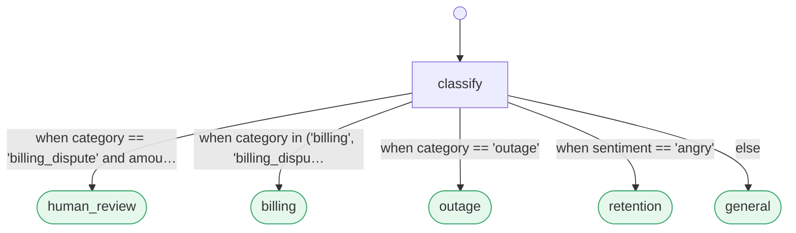

# PrismPath — agent workflows as data

[](https://github.com/crystal-warden/prism-path/actions/workflows/ci.yml)
&nbsp;[](LICENSE)
&nbsp;[](https://doi.org/10.5281/zenodo.21816125)

**The document your team reads is the graph the engine runs.**
Read it. Diff it. Lint it. Test it. Lock it. Prove it. Six verbs, each backed by a shipped
tool — try doing any of that to a Python callback.

**[Try it in your browser](https://www.crystalwardenlabs.com/playground)** — the kernel runs client-side, nothing to
install, nothing you type leaves the page.

PrismPath is built for five specific pains:

- **"What does this workflow actually do?"** means reading Python — the graph is smeared across
  callbacks, there's nothing to *read*.
- **The process owner can't change the process.** The SOC lead who knows the rules files a ticket and waits.
- **Every branch is an LLM call** — slow, not free, and models fumble the easy ones ("tests did *not*
  pass" routes wrong).
- **You can't test routing** without a model in the loop.
- **"Why did it go there?"** is a log dive, not an answer.

One Markdown file fixes all five.

## The whole idea in one file

```markdown
---
name: support_triage
start: classify
---

## classify
Read the incoming support ticket. Emit `category`, `amount`, and `sentiment`.
-> human_review: when category == "billing_dispute" and amount > 500
-> billing: when category in ("billing", "billing_dispute")
-> outage: when category == "outage"
-> retention: when sentiment == "angry"
-> general: else

## human_review
A person decides. High-value billing disputes are never auto-routed.

## billing
Apply the standard billing workflow.

## outage
Page the on-call engineer.

## retention
Hand off to the retention team.

## general
Answer from the support knowledge base.
```

That file **is** the program. Here it is as the engine sees it — verbatim `prismpath graph` output,
not a drawing:



Because the flow is data, **a pull request is a process change**: the `human_review` rule lands as a
three-line prose diff, a fixture row asserts it in CI (milliseconds, no model), and merging it changes
production routing — no deploy, no engineer. **See it run:** [`examples/pr_demo/`](prismpath/examples/pr_demo/README.md).

## Measured, not asserted

N=301 labeled routing decisions, 7 flows, same local model for every arm
([benchmark/](prismpath/benchmark/), reproducible):

| arm | accuracy | LLM calls / 1k decisions | median latency | p95 |
|---|---|---|---|---|
| **PrismPath** (hybrid over learned centroids, δ=0.03) | **95.3%** | **360** | **205 ms** | 655 ms |
| **PrismPath** (economy point, δ=0.01) | 90.0% | **160** | ~205 ms | — |
| PrismPath (zero-shot hybrid, δ=0.05) | 83.7% | 383 | 205 ms | 655 ms |
| LangGraph | 99.0% | 1000 | ~435 ms | ~460 ms |
| CrewAI | 99.0% | 1000 | ~435 ms | ~460 ms |
| LLM-router | 99.0% | 1000 | ~435 ms | ~460 ms |

```bash
python -m prismpath.comparisons.run_comparison   # reproduce the table against your own endpoint
```

The trade is a dial, not a verdict. The recommended setup — LLM-on-doubt over **learned per-condition
centroids** (5-fold cross-validated) — hits 95.3% at **2.8× fewer LLM calls** and about half the median
latency; turn δ up (or derive τ with `prismpath calibrate`) to trade toward ~99.7% at always-call prices.
Honest costs: an escalated hop pays the embedding *and* the LLM call (that's the p95), and centroids need
labeled history (zero-shot is the cold-start row). The external arms are more accurate out of the box
because they pay the model on *every* transition — if that's the right trade for your workload, use them.

## Level M runs on silicon — and in the kernel

The deterministic tier's Level M fragment ([SPEC §4.3](SPEC.md)) was designed as a match-action table.
It now runs as one on two substrates below software — **one fixed interpreter, every flow is data**
(edit the Markdown, recompile a small binary table, the circuit/program never changes):

- **FPGA fabric** (since 2026-08-07): a Level M flow compiles to a block-RAM table image
  (`incident_severity` = **136 bytes**; `wazuh_triage`, the production SOC flow unmodified, = 302 bytes).
  On a Zynq-7020 at 50 MHz a routing decision is **5–21 cycles (100–420 ns)** in **1,064 LUTs — 2.0% of
  the part**; the RTL reproduced **7,436 live sensor samples** bit-for-bit against the C reference.
  ([`prismpath-hw/`](prismpath-hw/README.md))
- **Linux kernel / eBPF** (since 2026-08-09): the same table compiles to a **verifier-accepted XDP
  program**, certified in-kernel against the frozen corpus. Attached observe-only to a live-traffic
  mirror it classifies real packets at **132–182 ns/packet (~5.5–7.6 Mpps/core)**, and its **policy
  hot-swaps live from a Markdown edit** — repopulate the maps of the running program, no detach, no
  reload. ([`prismpath-ebpf/`](prismpath-ebpf/README.md))

Both are certified on a **declared subset** of the frozen vectors — the portability pattern taken one
level down, never claimed as full SPEC §8 conformance, with every excluded vector carrying a
machine-readable reason. Every number has a row in the [evidence ledger](docs/research/supporting-evidence.md)
(#72–#78), each anchored in Bitcoin via OpenTimestamps. **Check the artifact, not the author.**

## Who wrote this — and why it shouldn't matter

Much of this code was written by AI agents under a gated control plane — the same one this repo ships.
The point of the project is that **correctness shouldn't depend on trusting the author**, so here are
the checks:

- **[1,067 predicate + 27 engine conformance vectors](prismpath/portable/conformance/README.md)**,
  frozen — passed by the Python reference plus three independent re-implementations
  ([JS](prismpath/portable/README.md), [Rust](prismpath-rs/CONFORMANCE.md), [Go](prismpath-go/README.md)):
  four kernels, four languages, agreeing bit-for-bit — the one check a plausible-looking codebase can't
  fake. (The [silicon + kernel targets](#level-m-runs-on-silicon--and-in-the-kernel) are certified on a
  declared subset and deliberately not counted as kernels.)
- **660+ tests** across the package and both adapters — [run them yourself](#running-the-tests).
- **[Reproducers for every measured number](docs/research/supporting-evidence.md)** — each paper claim
  maps to the script that produced it; the benchmark table regenerates with one command.
- **[Machine-enforced boundaries](tools/arch_guard.py)** — the rule is *never write a completeness claim
  a gate doesn't enforce*, and it binds the authors too: AI-written code landed only after compiling,
  passing the suites, and surviving the gates.

## Quickstart

```bash
git clone https://github.com/crystal-warden/prism-path.git && cd prism-path
pip install -e .                              # numpy only; embedder is an optional extra
prismpath validate prismpath/examples/pr_demo/triage.md   # "your flow compiles"
prismpath test prismpath/examples/pr_demo/triage.md       # fixture-asserted routing, no model
```

Or skip the terminal: the **[live playground](https://www.crystalwardenlabs.com/playground)** runs the
portable kernel in your browser — paste a flow, watch it route (it also ships offline at
[`portable/playground.html`](prismpath/portable/playground.html)).
**[GETTING_STARTED.md](GETTING_STARTED.md)** walks clone → a real agent driving your own flow, eight
steps each actually run before it was written down.

## When PrismPath is the wrong tool

- **A linear pipeline with no branching** — you don't need routing; a script is fine.
- **Maximum accuracy at any cost** — an LLM-on-every-transition router hits 99% on our benchmark.
  PrismPath's point is spending the model only where needed; if call volume is irrelevant, so is that edge.
- **You want a hosted platform and a connector catalog** — PrismPath is a format + kernel + control
  plane, deliberately not a SaaS or integration ecosystem.
- **Sub-millisecond routing over *semantic* conditions everywhere** — the semantic tier costs an
  embedding; only the deterministic tier is free (and for fields-only flows it
  [runs anywhere](prismpath/portable/README.md), browser to edge).
- **Run state grows unless you bound it** — `@state_bound(transcript=N)` keeps long-lived runs at a flat
  checkpoint (opt-in per flow).

## Tradeoffs & paradigm comparisons

Different tools, different jobs. PrismPath specializes in **auditable, safety-minded, edge-deployable
routing**, and gives up open-ended agentic freedom (dynamic graph creation, unconstrained tool loops) to
get it. If your problem needs that freedom, use a generalist framework — the table is honest about who
wins where.

| Framework | Primary Approach | Where It Excels | The Tradeoff vs. PrismPath |
|---|---|---|---|
| **PrismPath** | **Declarative Data (Markdown)** | Auditable SOPs, static compilation (`validate`), $0/sub-ms deterministic edges, P0/P1 edge JS/Rust/Go, Merkle Flow-Ledger | Dynamic graph creation & open-ended tool loops require internal worker nodes. |
| **LangGraph / Custom Python** | Imperative Python Stategraphs | Open-ended agentic exploration, dynamic graph generation, unconstrained tool loops | Hidden routing logic in Python callbacks, non-deterministic, no static linting, heavy runtime. |
| **XState** | TypeScript Statecharts (FSM) | Rich UI state machines, deterministic state transitions, event handling | Code-bound TS, lacks native hybrid LLM routing & cryptographic attestation ledgers. |
| **CrewAI / AutoGen** | Multi-Agent Roleplay Swarms | Open-ended agentic debate, creative multi-agent brainstorming | Highly non-deterministic, infinite chatter loops, zero static safety, high LLM token costs. |
| **Temporal / Cadence** | Microservice Orchestration (Code) | Massive throughput (100k+ exec/sec), microservice crash recovery & replay | Code-bound (Go/Java/Python); non-developers cannot audit rules; LLM routing is manual. |
| **n8n / Camunda (BPMN)** | Visual Drag-and-Drop / XML | Non-developer GUI builders, drag-and-drop web workflow design | Hard to version-control/diff in Git; LLMs are external API nodes without hybrid confidence escalation. |

The two strongest objections — *"structured output already solved routing"* and *"logic-as-data is a
rules engine, and we buried those"* — get full answers, concessions included, in
**[docs/objections.md](docs/objections.md)**. Onboarding a team? Start with
**[GETTING_STARTED.md](GETTING_STARTED.md)**.

## Five doors

- **Coming from LangGraph?** `prismpath import your_graph.py` renders your `StateGraph` as a skeleton
  flow — see your control flow as prose in fifteen minutes.
- **Platform / SRE:** the [lockfile](SPEC.md#7-portability-levels) (bit-reproducible routing),
  ["your flow compiles"](docs/guides/tour.md#your-flow-compiles--static-analysis), and OTel decision
  spans into the Grafana/Jaeger/Datadog you already run.
- **Security / compliance:** the [SOC triage case](docs/research/soc-triage-case-study.md) — prefilter
  reuse measured live, human-gated containment, ledger proofs, air-gap-friendly
  [portable subset](prismpath/portable/README.md).
- **Process owner / PM:** the [live playground](https://www.crystalwardenlabs.com/playground) and
  [persona examples](prismpath/examples/README.md) — no terminal; contribute a workflow (no code) to the
  [gallery](prismpath/gallery/README.md).
- **Researcher:** the [benchmark](prismpath/benchmark/), the [papers](docs/research/), and the
  [format spec](SPEC.md) with its machine-checkable conformance vectors.

> **Commercial support & custom flows** — PrismPath is developed by Crystal Warden Labs; we build and
> operate gated agent workflows (SOC triage, OT/edge policy enforcement) for clients.

---

## How routing works

Routing is a **spectrum chosen by the engine, not the author**:

| edge kind | syntax | how it routes | cost |
|---|---|---|---|
| **deterministic** | `-> t: when <expr>` (also `always`/`else`/`false`) | a safe predicate over the agent's structured outcome (+ a `visits` counter) | free, exact |
| **semantic** | `-> t: <natural language>` | embed the outcome vs the condition; escalate to a 1-shot LLM only on low confidence | ~free + rare LLM |

At a node, **deterministic edges evaluate first, in document order — first true wins**; only if none
match do semantic edges go to the router. *Logic where logic exists, intent where it doesn't.* The rest
of the machinery — agent contract, routers, the prefilter cache, `verify`, fan-out, attestation, the
portable kernels — is a ten-minute read: **[docs/guides/tour.md](docs/guides/tour.md)**. The sprint
control plane on top: **[docs/design/control-plane.md](docs/design/control-plane.md)**.

## Ports & adapters — one engine, many domains

The engine owns routing, attestation, and the toolchain; **domains plug in behind ports** (Ingestion,
Retrieval, Adjudicator, Action/Sink, Attestation, Deferral) with **no domain vocabulary in the core** —
`tools/arch_guard.py` enforces that boundary (a domain noun in the core is a hard fail). Two reference
adapters exercise the same ports:

- **SOC triage** (`adapters/soc/`) — decomposed alert triage with the prefilter cache, human-gated
  containment, and Flow-Ledger proofs ([use case](docs/research/soc-triage-case-study.md)).
- **Compliance — NIST SP 800-171** (`adapters/compliance/`) — a full-breadth assessment adapter:
  runtime-selectable dual catalog (Rev 2 = 110 controls / 14 families with DoD SPRS weights; Rev 3 =
  130 / 17, official NIST OSCAL), a family-agnostic decomposed flow, escalation-default adjudication, a
  schema-validated dual OSCAL + CycloneDX emitter, a partial-SPRS rollup, provable human-override and
  evidence-discovery loops, and a ~130-test suite plus a held-out efficacy harness. See its
  `ADAPTER_CONTRACT.md` and `TESTING.md`.

> Adapters live in `adapters/` and import the `prismpath` package; promoting them to installable plugin
> packages is planned. New here? Start with **[ROADMAP.md](ROADMAP.md)** or
> **[GETTING_STARTED.md](GETTING_STARTED.md)**.

## Status

Working end to end: the flow kernel (parser / predicates / hybrid router / engine); the data-plane
toolchain (validate/lint, `test`, lockfile, calibrate, centroids, graph, import, label, portable,
verify, lsp); fan-out/composition with its Mission Control Flows view; the durable layer (checkpoints,
scheduler, git Flow-Ledger, OTS anchoring); the Connector SDK (six ports); the sprint control plane; and
the portable kernels with their frozen vectors — the Python reference plus **three independent
re-implementations (JS, Rust, Go), each passing all 1,067 predicate + 27 flow vectors**. The Level M
fragment additionally [runs in FPGA fabric and as an in-kernel eBPF/XDP
program](#level-m-runs-on-silicon--and-in-the-kernel), each certified on a declared subset.
**563 Python tests + 18 Node kernel tests passing** (the compliance adapter adds ~130 more with
adversarial attestation-tamper + hypothesis coverage); the predicate sandbox is fuzz-hardened; the
format is specified in [SPEC.md](SPEC.md) (v1 draft). This repo is a curated export of an active research
control plane; the `eval_*.py` / `measure_*.py` scripts are the harnesses behind every number in the
papers. Licensed Apache-2.0.

### The launch is anchored

The project that ships tamper-evident attestation launched with its own machinery pointed at itself: the
`v0.1.0` release artifact is OpenTimestamps-anchored in **Bitcoin block 961224** (2026-08-06). Don't take
our word or GitHub's timestamps — rebuild from the tag and check the chain:

```
git archive --format=tar.gz --prefix=prismpath-0.1.0/ v0.1.0 | sha256sum
# b3f07facaacc4daaead1cc8f53caf4637b7b1aaf1a165b3c50b949566ce52112
ots verify prismpath-0.1.0.tar.gz.ots   # .ots proofs ship with the release
```

The tarball, `SHA256SUMS`, and both `.ots` proofs are attached to the
[v0.1.0 release](https://github.com/crystal-warden/prism-path/releases/tag/v0.1.0).

## Contributing & community

- [GETTING_STARTED.md](GETTING_STARTED.md) — zero to a routed flow in eight steps.
- [CONTRIBUTING.md](CONTRIBUTING.md) — the perfect first contribution is a lint rule (ten are waiting);
  DCO sign-off, not a CLA.
- [CODE_OF_CONDUCT.md](CODE_OF_CONDUCT.md) · [SECURITY.md](SECURITY.md) (sandbox + conformance claims are
  in scope) · [SPEC.md](SPEC.md) · [CHANGELOG.md](CHANGELOG.md) · [CITATION.cff](CITATION.cff)
- **Use it in CI:** the [`prismpath` GitHub Action](action.yml) or the
  [pre-commit hooks](.pre-commit-hooks.yaml) run `validate` + `test` on your flows.
- **Gallery:** real workflows contributed by the people who run them — [gallery/](prismpath/gallery/README.md).

## Docs

Long-form docs live in **[docs/](docs/README.md)** — start there for the index. Highlights:

- [decoder-ring.md](docs/decoder-ring.md) — **the glossary and repo map**: every borrowed term in plain
  language, plus where every document, module, kernel, and command lives.
- [SPEC.md](SPEC.md) — the format spec (grammar, tiers, predicate semantics, conformance) ·
  [ROADMAP.md](ROADMAP.md) — roadmap and future vision.
- [guides/](docs/guides/) — [ten-minute tour](docs/guides/tour.md) · [authoring](docs/guides/authoring.md)
  · [frontier-agent integration](docs/guides/frontier-agent-integration.md).
- [design/](docs/design/) — [control plane](docs/design/control-plane.md) ·
  [architecture](docs/design/architecture.md) · [framework](docs/design/framework.md) ·
  [guard onion](docs/design/spec-guard-onion.md) · [ledger anchoring](docs/design/spec-ledger-opentimestamps.md).
- [research/](docs/research/) — [primer](docs/research/primer-students-guide.md) ·
  [research paper](docs/research/paper-routing-spectrum.md) ·
  [engineering white paper](docs/research/whitepaper-engineering.md) ·
  [supporting evidence](docs/research/supporting-evidence.md) ·
  [bypass measurement](docs/research/bypass-measurement.md) ·
  [SOC triage case study](docs/research/soc-triage-case-study.md).

Docs beside the code: [portable kernel](prismpath/portable/README.md) ·
[examples](prismpath/examples/README.md) · [gallery](prismpath/gallery/README.md) ·
[benchmark](prismpath/benchmark/README.md) · [comparisons](prismpath/comparisons/README.md) ·
[editor surfaces](prismpath/editor/README.md) · [adapter standard](adapters/ADAPTER_GUIDE.md).

## Running the tests

```bash
python -m pytest prismpath/tests -q     # parser, predicates, router, engine
python prismpath/eval_flows.py          # routing-accuracy mini-evals on the example flows
```
